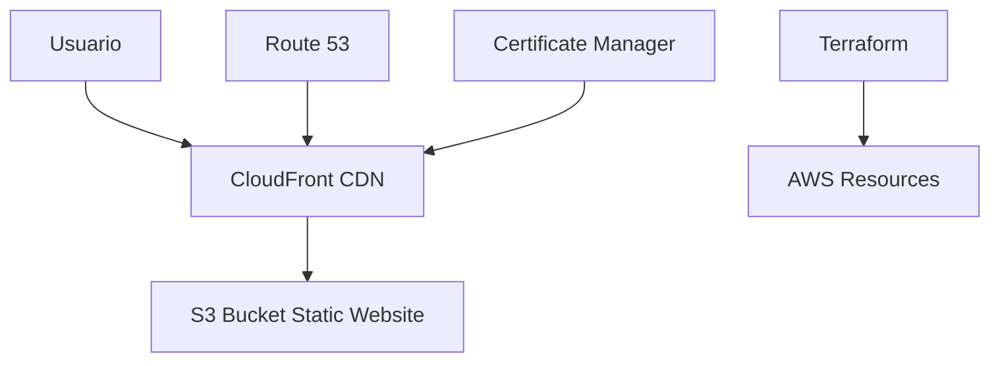

# 🏦 Inferno Bank - Frontend & Infrastructure

[](https://angular.io/)
[](https://terraform.io/)
[](https://aws.amazon.com/)
[](https://www.typescriptlang.org/)

> Una aplicación bancaria moderna con frontend Angular y infraestructura automatizada en AWS usando Terraform.

## 📋 Tabla de Contenidos

- [🏗️ Arquitectura del Proyecto](#️-arquitectura-del-proyecto)
- [🚀 Características](#-características)
- [📁 Estructura del Proyecto](#-estructura-del-proyecto)
- [⚙️ Tecnologías Utilizadas](#️-tecnologías-utilizadas)
- [🛠️ Instalación y Configuración](#️-instalación-y-configuración)
- [📦 Despliegue](#-despliegue)
- [🌐 Infraestructura AWS](#-infraestructura-aws)
- [🔧 Scripts Disponibles](#-scripts-disponibles)
- [📚 Documentación](#-documentación)
- [🤝 Contribuciones](#-contribuciones)

## 🏗️ Arquitectura del Proyecto

```
myCatalogoPage/
├── 🅰️ app/          # Frontend Angular
├── 🏗️ terraform/    # Infraestructura AWS
└── 📖 README.md     # Documentación
```

### Componentes Principales

- **Frontend**: Aplicación web Angular con interfaz moderna y responsiva
- **Infraestructura**: Despliegue automatizado en AWS usando Terraform
- **CI/CD**: Pipeline de despliegue automatizado

## 🚀 Características

### Frontend (Angular)
- ✅ **Interfaz Moderna**: Diseño responsive y user-friendly
- ✅ **TypeScript**: Tipado fuerte para mejor mantenibilidad
- ✅ **Angular 17+**: Última versión con mejoras de rendimiento
- ✅ **Vite**: Build tool ultra-rápido para desarrollo
- ✅ **PWA Ready**: Preparado para Progressive Web App

### Infraestructura (Terraform)
- ✅ **Infrastructure as Code**: Infraestructura versionada y reproducible
- ✅ **AWS Integration**: Despliegue nativo en Amazon Web Services
- ✅ **Multi-Environment**: Soporte para múltiples entornos (dev, staging, prod)
- ✅ **Auto Scaling**: Escalado automático basado en demanda
- ✅ **Security First**: Configuraciones de seguridad por defecto

## 📁 Estructura del Proyecto

### 📱 Frontend (`/app`)
```
app/
├── src/
│   ├── app/              # Componentes principales
│   ├── index.html        # Página principal
│   ├── main.ts          # Bootstrap de la aplicación
│   └── styles.css       # Estilos globales
├── public/              # Assets estáticos
├── angular.json         # Configuración Angular
├── package.json         # Dependencias npm
└── tsconfig.json        # Configuración TypeScript
```

### 🏗️ Infraestructura (`/terraform`)
```
terraform/
├── main.tf              # Recursos principales AWS
├── variables.tf         # Variables de configuración
├── data.tf             # Data sources
├── provider.tf         # Configuración de providers
├── terraform.tfvars    # Variables de entorno
├── deploy.sh           # Script de despliegue
└── .terraform/         # Cache de Terraform
```

## ⚙️ Tecnologías Utilizadas

### Frontend
| Tecnología | Versión | Propósito |
|------------|---------|-----------|
|  | 17+ | Framework principal |
|  | 5.0+ | Lenguaje de programación |
|  | Latest | Build tool y dev server |

### Infraestructura
| Tecnología | Versión | Propósito |
|------------|---------|-----------|
|  | 1.0+ | Infrastructure as Code |
|  | Latest | Cloud Provider |

## 🛠️ Instalación y Configuración

### Prerrequisitos

- **Node.js** >= 18.0.0
- **npm** >= 9.0.0
- **Angular CLI** >= 17.0.0
- **Terraform** >= 1.0.0
- **AWS CLI** configurado
- **Git**

### 🏃‍♂️ Inicio Rápido

1. **Clonar el repositorio**
   ```bash
   git clone https://github.com/SRT2801/inferno-bank-terraform-frontend.git
   cd inferno-bank-terraform-frontend
   ```

2. **Configurar Frontend**
   ```bash
   cd app
   npm install
   npm start
   ```
   🌐 La aplicación estará disponible en `http://localhost:4200`

3. **Configurar Infraestructura**
   ```bash
   cd ../terraform
   cp terraform.tfvars.example terraform.tfvars
   # Editar terraform.tfvars con tus valores
   terraform init
   terraform plan
   ```

## 📦 Despliegue

### 🏗️ Despliegue de Infraestructura

```bash
cd terraform

# Inicializar Terraform
terraform init

# Revisar cambios
terraform plan

# Aplicar infraestructura
terraform apply

# O usar el script automatizado
./deploy.sh
```

### 🚀 Despliegue de Frontend

```bash
cd app

# Build para producción
npm run build

# Los archivos se generarán en dist/
# Serán desplegados automáticamente por Terraform
```

## 🌐 Infraestructura AWS

### Recursos Creados

- **S3 Bucket**: Hosting estático del frontend
- **CloudFront**: CDN para distribución global
- **Route 53**: DNS y dominio personalizado
- **Certificate Manager**: Certificados SSL/TLS
- **IAM Roles**: Permisos y seguridad

### Arquitectura AWS



## 🔧 Scripts Disponibles

### Frontend (`/app`)

| Script | Comando | Descripción |
|--------|---------|-------------|
| **Desarrollo** | `npm start` | Servidor de desarrollo |
| **Build** | `npm run build` | Build para producción |
| **Test** | `npm test` | Ejecutar pruebas |
| **Lint** | `npm run lint` | Análisis de código |

### Infraestructura (`/terraform`)

| Script | Comando | Descripción |
|--------|---------|-------------|
| **Deploy** | `./deploy.sh` | Despliegue completo |
| **Plan** | `terraform plan` | Ver cambios planeados |
| **Apply** | `terraform apply` | Aplicar cambios |
| **Destroy** | `terraform destroy` | Eliminar infraestructura |

## 📚 Documentación

### 📖 Guías Adicionales

- [Configuración de AWS](docs/aws-setup.md)
- [Guía de Desarrollo](docs/development.md)
- [Troubleshooting](docs/troubleshooting.md)

### 🔗 Enlaces Útiles

- [Documentación Angular](https://angular.io/docs)
- [Documentación Terraform](https://terraform.io/docs)
- [AWS Documentation](https://docs.aws.amazon.com/)

## 🤝 Contribuciones

¡Las contribuciones son bienvenidas! Por favor:

1. Fork el proyecto
2. Crea una rama para tu feature (`git checkout -b feature/AmazingFeature`)
3. Commit tus cambios (`git commit -m 'Add some AmazingFeature'`)
4. Push a la rama (`git push origin feature/AmazingFeature`)
5. Abre un Pull Request

## 📄 Licencia

Este proyecto está bajo la Licencia MIT. Ver el archivo `LICENSE` para más detalles.

## 👨‍💻 Autor

**Tu Nombre** - [@SRT2801](https://github.com/SRT2801)

---

<div align="center">
  <p>⭐ ¡Dale una estrella si te gustó el proyecto! ⭐</p>
  <p>🔧 Construido con ❤️ usando Angular y Terraform</p>
</div>
